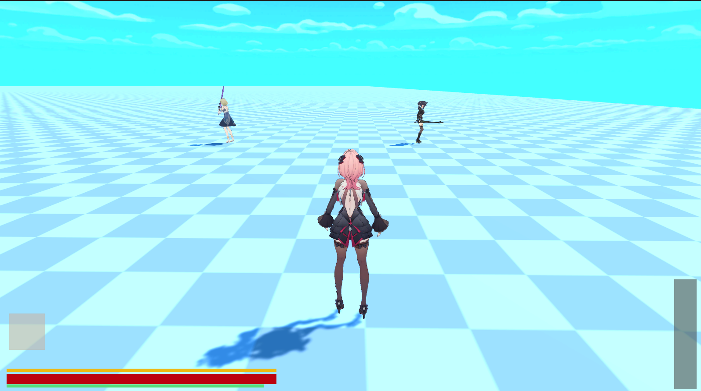
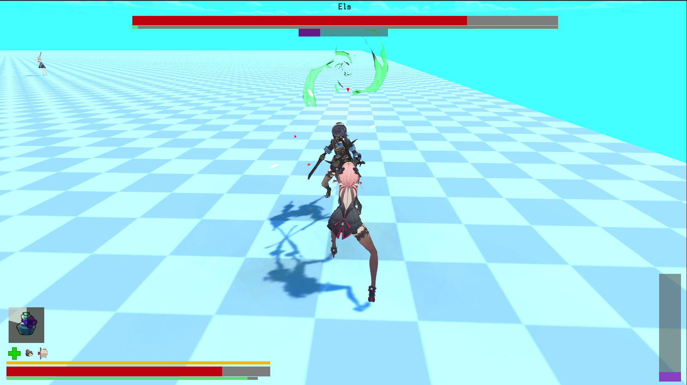
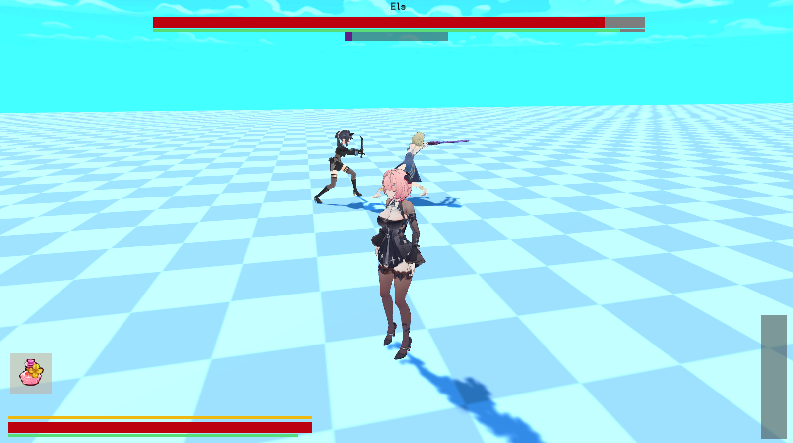
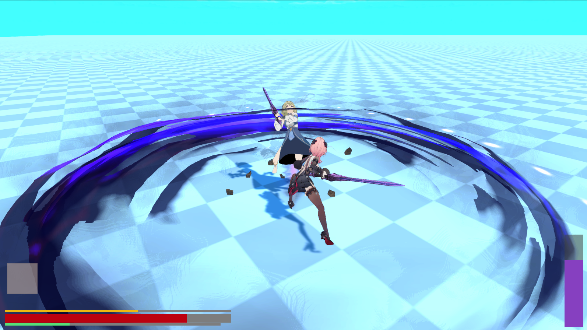

## 🎮 项目名称

3D ARPG GamePlay Demo（Unity）

------

## 📌 项目简介

一个基于 Unity 开发的第三人称 3D ARPG 战斗 Demo，重点实现角色状态机驱动的战斗系统、锁定目标机制、Buff 与道具数据驱动系统，以及简单的角色属性与韧性系统。

项目主要用于展示客户端架构设计能力与战斗系统实现能力。

演示视频：https://www.bilibili.com/video/BV11hoaB6Ehx

【注意】本仓库未上传美术资源（材质、动画等）如需要运行请通过以下链接下载

百度网盘： https://pan.baidu.com/s/1ud-MtSmNQHrb1QqOfvNkIQ?pwd=6dry

------

## 🛠️ 技术栈

- Unity
- C#
- Unity Input System
- Animator 状态机
- ScriptableObject 数据驱动
- 对象池

------

## ✨ 功能列表

### 🎯 角色控制

- 八向移动
- 奔跑 / 行走切换
- 锁定目标移动模式
- 平滑动画过渡

### ⚔️ 战斗系统

- 普通攻击连击
- 格挡系统
- 受击打断
- 反击机制
- 韧性（Poise）系统
- 体力系统

### 🎯 锁定系统

- 最近目标选择
- 左右目标切换
- 锁定相机跟随
- 目标丢失自动解除锁定

### 💊 Buff 系统（ScriptableObject）

- 攻击力增幅 Buff
- 回血/持续回血 Buff
- 韧性增强 Buff
- 支持运行时实例
- 支持对象池复用

### 🎒 道具系统

- ScriptableObject 数据驱动
- 道具触发 Buff
- 可切换当前道具
- 事件驱动UI更新

### 📊 角色属性系统

- HP / Stamina / Power
- 攻击力
- 攻速
- 韧性
- 体力消耗与恢复

### 🧠 AI 敌人

- 追击玩家
- 环绕玩家
- 攻击判定
- 受击反馈
- 死亡状态

### 🧩 UI 系统

- Buff 图标显示
- 动态添加/移除
- 对象池复用 UI

### ♻️ 对象池系统

- GameObject 对象池
- 普通类对象池
- Buff 实例复用
- UI 对象复用
- 武器对象复用

------

## 🏗️ 核心架构

### 状态机驱动角色逻辑

```
Idle
 ├── Move
 ├── Attack
 ├── Block
 ├── Hit
 ├── Stagger
 └── Death
```

------

### Buff 数据驱动架构

```
BuffData (ScriptableObject)
        ↓
Runtime Buff Instance
        ↓
BuffController 管理
        ↓
UI 事件驱动显示
```

------

### 道具触发流程

```
ItemData (SO)
     ↓
Use Item
     ↓
Add Buff
     ↓
BuffController
     ↓
属性变化 + UI更新
```

------

## 📂 项目结构

```
Scripts
├── StateMachine
├── Combat
├── Buffs
├── Items
├── UI
├── AI
├── Controller
├── Model
├── Pool
└── Input
```

------

## 🎯 项目亮点

- 使用 **状态机架构** 管理角色行为
- 使用 **ScriptableObject** 实现 Buff 与道具数据驱动
- 实现 **锁定目标战斗系统**
- 设计 **韧性 (Poise) 战斗机制**
- 使用 **对象池优化 Buff 与 UI**
- 逻辑层与 UI 层 **事件解耦**
- 支持多 Buff 同时生效

------

## 🎮 操作说明

| 按键 （电脑/手柄）    | 功能         |
| --------------------- | ------------ |
| WASD/左摇杆           | 移动         |
| Shift/ B              | 奔跑         |
| 鼠标左键/ X           | 攻击         |
| 鼠标右键 / Y          | 格挡         |
| Tab/ 右摇杆按下       | 锁定目标     |
| 鼠标移动 / 右摇杆移动 | 切换锁定目标 |
| E / 上按钮            | 使用道具     |
| C / 右按钮            | 切换道具     |
| R / 右肩键            | 武器技能     |
| Q/ 左肩键             | 武器切换     |

------

## 📷 演示截图







